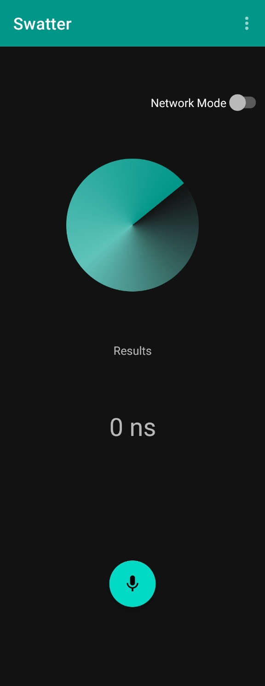

# SWATTER

---

Deep learning based real time UAV detection using smartphones as Edge Computing device.

- 2023 Winter (Purdue University, West Lafayette, Indiana, USA)

# Introduction

---

UAV technology is currently being used in various fields such as agriculture, communication, logistics, and is expected to be used in more fields in the future.
Unfortunately, as drone technology advances, incidents of careless misuse, military surveillance, and malicious activity of drones have increased.
Drone detection is an important issue not only to prevent unfortunate accidents caused by drones, but also to prevent crime by detecting malicious drones. 

> **Novelty**
> 

```
1. Easy to use
Many solutions use machine learning models with high performance to detect drones.
However, in order to apply a high-performance machine learning model, a computer with appropriate performance is required.
Therefore, in real life, if the user needs to check in real time if there is a drone nearby, there is a possibility that there will be restrictions on its use.

2. Use the application
Even when users do not have radar, microphones, etc., other methods are needed to locate the drone. 
Hence, in this paper, we propose a method for finding drones using a machine learning-based smartphone application. 
Since most people are using smartphones, this solution is very practical. 
When a drone detection application is developed, users can install the application with just a few touches and check if there is a drone near.
```

# System Overview

---


   
   
# 📱Application

---

Code & Environment link

> **Setup**
> 

```bash
Install .apk file in Android Smartphone (Android 8.1 or later)
```

> **Implementation**
> 
1. Record sound data using [**Android-Wav-Recoder**](https://github.com/squti/Android-Wave-Recorder)
2. Mel-frequency cepstral coefficients feature extraction with **[jlibrosa](https://github.com/Subtitle-Synchronizer/jlibrosa)**
3. Input extracted feature data to Pre-trained model using [**Tensorflow lite Interpreter**](https://github.com/tensorflow/tensorflow)

   
   
# 📘Object_Detection

---

Code & Environment link

> **To run training code**
> 
- Download Object_Detection folder

### Linux

```
# Install Anaconda
$ wget <https://repo.anaconda.com/archive/Anaconda3-2022.10-Linux-x86_64.sh>
$ bash 'Anaconda3-2022.10-Linux-x86_64.sh'

# Run Anaconda
$ source ~/.bashrc
or
$ . ~/.bashrc

# Make virtual environment
conda create -n uavml python==3.9.5
conda activate uavml
sudo apt-get install libsndfile1
sudo apt-get install make

# Run training code
make env
make train
```

> **Feature Extraction**
> 
1. Feature extraction is the process of transforming raw data into numerical features
2. Extract features of UAV sound data with [**librosa**](https://github.com/librosa/librosa)
3. Using MFCC features with 40 shape.

> **Support Vector Machine**
> 
1. SVM (Support Vector Machine) is supervised machine learning for classification and regression.
2. Using SVM algorithm for clssify UAVs.
3. Train algorithm and pass the model file to application and server.

   
   
# 🖥️Server

---

[Code & Environment link](https://github.com/MINJILEE-PURDUE/KSW_2023_Winter_Program/tree/main/SWATTER/code/Server)

> **The server for comparing the inference time**
> 

### Linux (CentOS 7)

- C++ 17 (GCC 8)
- Python 3.9.5
- TCP Socket Server
   
# Results

---




- Blue means there’s no drone
- Red means detect drone

   
   
# 👨‍👩‍👧‍👦Collaborator

---

```
💂‍♂️ Joonki Rhee
- Kyonggi University, Suwon, South Korea
- Major in Computer Science
- rhe9788@kyonggi.ac.kr
- 👾 github.com/JK831

💂‍ Gwangwon Kim
- Kyonggi University, Suwon, South Korea
- Major in Industrial Engineering, Data Engineering
- tiger6777@kyonggi.ac.kr
- 👾 github.com/dev-gw

💂‍ Minseop Shin
- Dongseo University, Busan, South Korea
- Major in Software Engineering
- 20191520@office.dongseo.ac.kr
- 👾 github.com/dev-sms

💂‍ Hyunjong Jang
- Dongseo University, Busan, South Korea
- Major in Software Engineering
- 20191580@office.dongseo.ac.kr
- 👾 github.com/HyeonjongJang

💂‍ Justin Allange
- Purdue University, West Lafayette, Indiana, USA
- Major in Computer and Information Technology
- jallange@purdue.edu
- 👾 github.com/jallange
```
